# Tencent KonaJDK

# 任务2

本任务分为准备工作和分析工作。**分析在前**，先得出相关结论，结果和过程在第二章`具体操作部分`。最后第三章得出总结论

- **数据分析**：实现并分析concurrent Mark和其对应的Mixed GC后old regions 的情况
  - 相关日志报告文件均在`JtregAndLogs`目录下

- **具体操作**：环境搭建，代码编写，jvm参数设计等
  - 具体信息，均在日志中全部体现，主测试程序除开头文件也均写出体现
- **总结论**


`ps`：G1 GC相关学习整理信息，在`G1 GC.md`文件中（持续整理中）


# 一、数据分析

## 1.1 G1 Evacuation Pause

​	通常在年轻代区域填满时触发。当应用程序创建对象速度较快，年轻代中的空间迅速被填满时，G1 GC 会触发 Evacuation Pause。此过程中，年轻代中的存活对象会被移动到存活区，同时回收年轻代中的死亡对象空间。

### 表格

|      检测阶段       | Before Concurrent Start | After Concurrent Start |    After Mixed    |
| :-----------------: | :---------------------: | :--------------------: | :---------------: |
|     Old regions     |            n            |           n            | n不变或者少量增加 |
| 高活跃度Old regions |            n            |   n不变或者少量减少    | n回复或者少量增加 |

### Jtreg输出 - 对照 - log输出

- 初始Before Concurrent Start阶段，old regions都很活跃：

  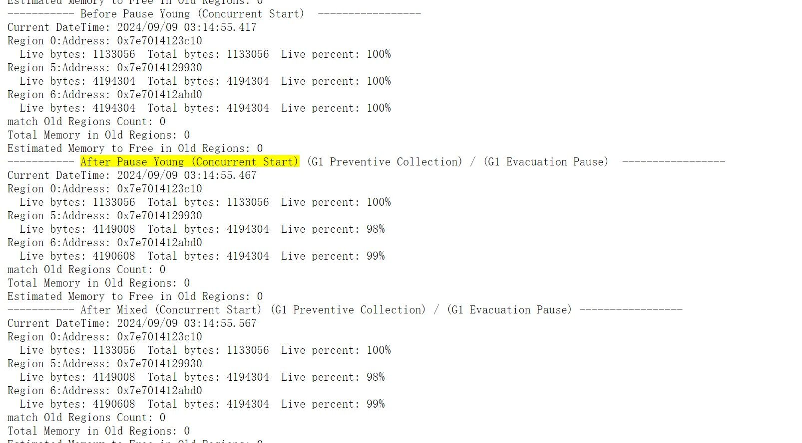

- 如果没有在并`发标记周期`找到“死”对象的话，则不会引发mixed gc，如果有，那么便进行处理。

  1. 下面的图代表没有找到“死”对象的情况，会直接进入到下一个正常gc阶段

     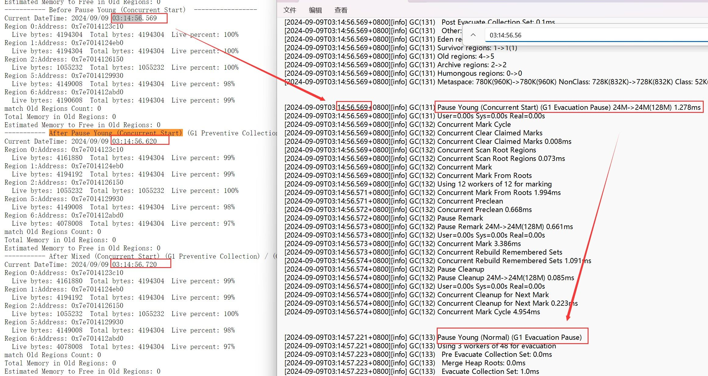

  2. 下图代表找到有“死”对象的情况，并且mixed GC后，因为有大量的老且活跃的对象继续晋升到old region，所以old region数量还要上升，如图，从快照阶段的 7 到并发阶段的8 到mix后的9

     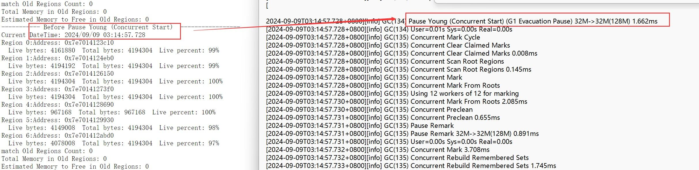

     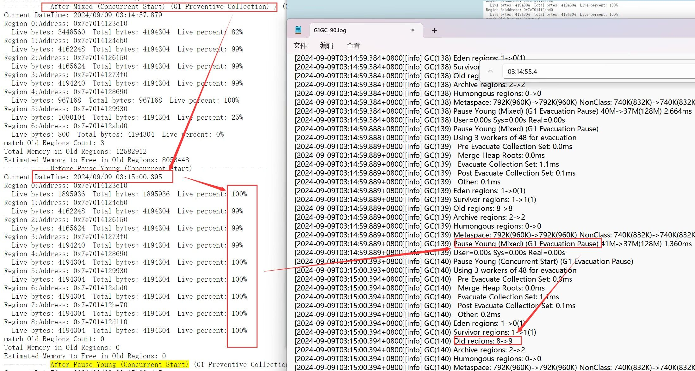


### 分析

​	年轻代主要包括 Eden 区和两个 Survivor 区（From 和 To）。随着对象的不断产生，Eden 区和 Survivor 区可能很快填满，需要进行清理以为新对象提供空间。会标记整个堆的部分区域，开始并发标记周期，预备后续的混合回收阶段。主要分析这三个阶段old regions的现象和原因：

1. **Before Concurrent Start old regions 存活对象比例高**：老年代中活跃对象的比例可能看起来较高，因为此时尚未完成任何实际的垃圾回收，只是**标记对象**。
2. **After Concurrent Start old regions 存活对象比例低**：在并发标记结束后，**标记确认后识别**出哪些老年代区域中的对象是“死”的，从而减少了活跃对象的比例。
3. **After Mixed old regions 存活对象比例高**：Mixed GC 中，G1 GC 会清理掉标记为可回收的老年代区域和年轻代区域中的对象。由于对象的晋升和新对象的创建，新的或临时的活跃对象可能在老年代中积累。导致在短时间内提高活跃对象的比例。

**结论**：

​	**因为程序设计在短时间内，大量对象产生，年轻代的区域填满，年轻代中存活了多次的对象进入老年代。**导致old regions 中有大量的活跃对象不会被清理，即使有对象被Evacuation Pause引发的mixed gc处理掉，也会快速被年轻代的对象进入老年代，反而可能会增加old regions 的数量。

​	**不是每一个Concurrent  Evacuation 后都会直接 Mixed 等操作，部分相隔一段时间**


## 1.2 G1 Humongous Allocation

​	如果一个对象的大小大于一个区域的大小，G1 会寻找连续的空闲区域来存放这个对象。**如果可用的连续空间不足**，G1 GC 会尝试进行垃圾回收，以释放足够的连续区域来满足巨型对象的需求。通常不会像小对象那样频繁地被分配和回收。

### 表格

|         检测阶段          |        Before Concurrent Start         |        After Concurrent Start         |                   After Mixed                    |
| :-----------------------: | :------------------------------------: | :-----------------------------------: | :----------------------------------------------: |
|        Old regions        |                   n                    |               n逐渐变少               | 本身较难变动，但是可能触发Pause Full导致大量减少 |
| 高活跃度<br />Old regions |                   n                    |               n逐渐变少               |                       极少                       |
|     Humongous region      |                   0                    |         逐渐变多（程序原因）          |               逐渐变多（程序原因）               |
|       **检测阶段**        | **Evacuation Pause Before Concurrent** | **Evacuation Pause After Concurrent** |                 **After Mixed**                  |
|        Old regions        |                  极少                  |    由于Evacuation Pause，逐渐变多     |                    n上下浮动                     |

### Jtreg输出

​	开始小对象晋升old region较多，old region数量增加，到后面因为全堆回收`Pause Full (G1 Compaction Pause)`，涉及到整个堆的压缩。导致old region变少。

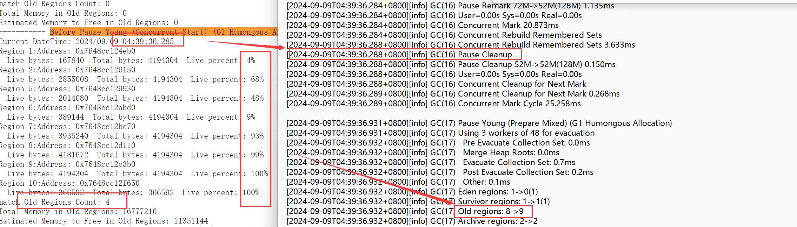

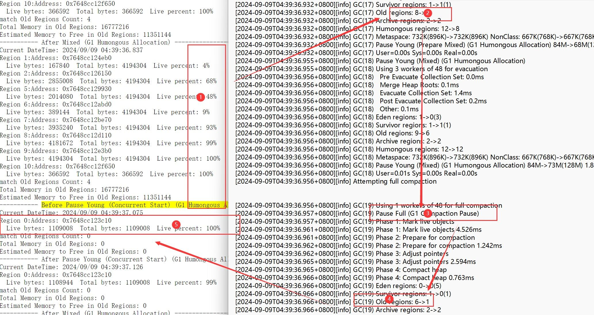

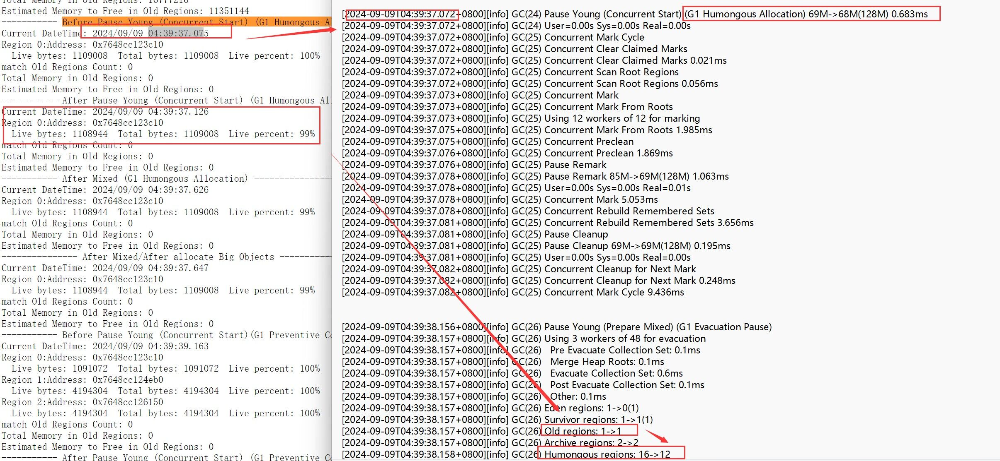

### 分析

1. **Before Concurrent Start old regions **：标记堆中所有直接可达的对象。但是因为堆中存在大量的 Humongous 对象，后续观察是否所有堆 。old regions影响不大。
2. **After Concurrent Start old regions**：并发标记阶段，是标记堆中所有可达的对象。识别为不再使用的 Humongous 对象**将会**被回收。如果这些对象存活，则它们会继续占据 Humongous regions。old regions影响不大。
3. **After Mixed old regions**：Mixed GC 中，识别为不再使用的 Humongous 对象将会被回收。如果这些对象存活，则它们会继续占据 Humongous regions。old regions影响不大。

**结论**：

​	图1因为allocation 分配不均衡时，将触发Homongous region的清理，但是由于**程序原因，先是小对象分配**，导致old region 数量在最开始比较大，但活跃度不均衡。后续随着大对象的分配Homongous region，导致old region数量逐渐减少，并且因为小对象的分配存在，导致**少量的old region数+高活跃对象比例**的现象产生

​	可以看出，因为`LRU结构`保证对象可以存活一段时间+`程序设计`保证可以大型对象连续产生，从而引发Humongous Allocation。但是大的对象在产生的过程中，没有及时处理，导致在Humongous Allocation的时候，发现只有很少或者没有 Humongous Object可以被消除，也就是说，对应的old regions 没有被清理掉，仍然存在（除非类似Pause Full压缩整个堆空间）。分析中，因为**Humongous region是old region的一种特殊情况**，特此分析，也可以发现 Humongous Allocation 因为LRU结构，比较难以清理old regions的对象。


## 1.3 G1 Preventive Collection

​		预防性收集是一种主动的垃圾回收策略，旨在在内存压力达到阈值（`"-XX:InitiatingHeapOccupancyPercent"`）之前先行触发垃圾收集，以此降低未来应用运行中的延迟。


### 表格

|         检测阶段          |        经历 Concurrent Start         |                经历 Prepare Mixed                |                 After Mixed                 |
| :-----------------------: | :----------------------------------: | :----------------------------------------------: | :-----------------------------------------: |
|        Old regions        | n不变/轻微变多（由于小对象大量产生） | 本身较难变动，但是可能触发Pause Full导致大量减少 |   n减少，也可能触发Pause Full导致大量减少   |
| 高活跃度<br />Old regions |              活跃度不变              |                    活跃度不变                    | 活跃度不变，只是低于阈值的在mixed中处理掉了 |

### Jtreg输出

​	通过log日志，和jtreg工具箱的输出进行匹配，重点观察了，`Concurrent Start` ; `Prepare Mixed`; ` After Mixed`三个重要阶段，前后的old regions 的数量和活跃程度

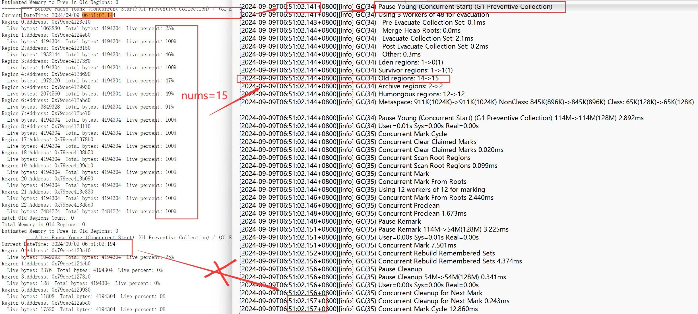

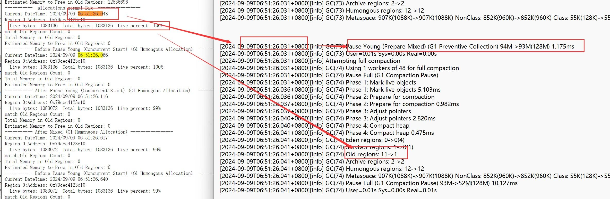

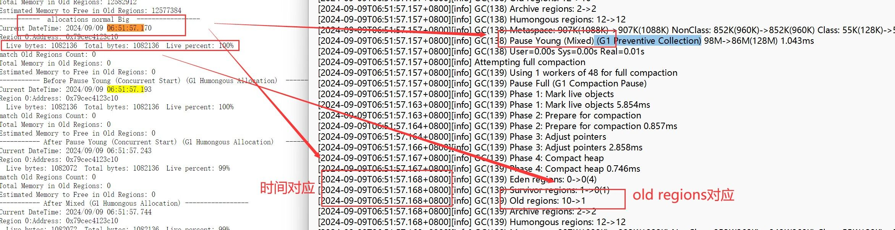

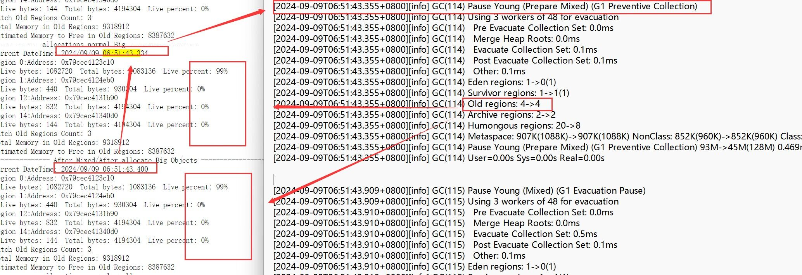

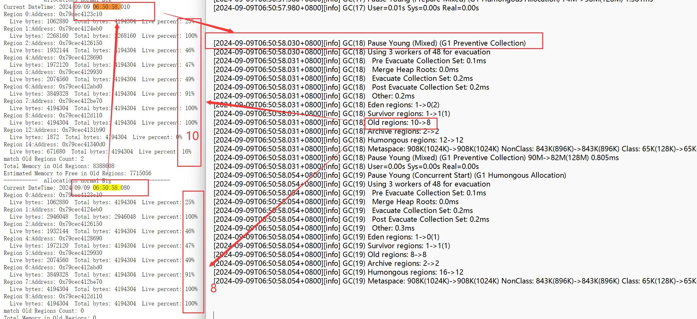


### 分析

1. **Concurrent Start old regions**：当堆内存的使用达到 `-XX:InitiatingHeapOccupancyPercent` 所设置的阈值，JVM 会启动并发标记周期。及时标记和评估堆中的对象存活情况
2. **Prepare Mixed old regions**：完成并发标记周期后，根据堆中的存活对象和区域的分布情况，G1 将根据收集到的数据决定是否进行一次混合回收，这包括部分老年代的区域和所有年轻代区域。
3. **Mixed old regions**：Mixed GC 中，在不影响应用性能的前提下，逐步清理老年代中的部分区域，减少将来进行全堆回收的可能性。

**结论**：

​	G1 Preventive Collection在实验条件下，**没有1次**产生`Concurrent  -- > Prepare Mixed --> Mixed GC`的执行链，这与G1 GC的工作性质有关从实验结果来看：

1. 在``Concurrent 并发标记周期和Prepare Mixed 评估周期`均没有进行Old regions 的数量大量变化，基本都是年轻代像老年代的一个晋升，导致old region数量微量上升。
2. 在当决定`Mixed GC阶段`，会选中低于阈值的old region，也就是说，**满足**了Prepare Mixed 评估周期中的条件，因此开始执行，并成功清除垃圾对象，**将old region 进行释放，从而达到old region数量减少的情况。**


# 二、准备工作

## 2.1 编译文件

在Linux环境下Ubuntu22.04，通过命令行参数传递给 `configure` 脚本。

```bash
bash configure --with-boot-jdk=/home/cxl/projects/TencentKona/TencentKona-17.0.11.b1 --with-jtreg=/home/cxl/projects/TencentKona/tools/jtreg
```

- 通过`--with-jvm-features=-shenandoahgc`中的`-`是否存在来决定是否开启或关闭某一个jvm特性，本次没有关闭，默认开启（也可以通过`--with-jvm-features=shenandoahgc`再开启）。
- 通过`--with-boot-jdk=/home/cxl/projects/TencentKona/TencentKona-17.0.11.b1`，使用存在的 JDK 来编译新的 JDK。
- 通过`--with-jtreg=/home/cxl/projects/TencentKona/tools/jtreg`，指定jtreg工具路径，以确保在OpenJDK构建过程中能够正确地找到并使用`jtreg`来运行测试用例。

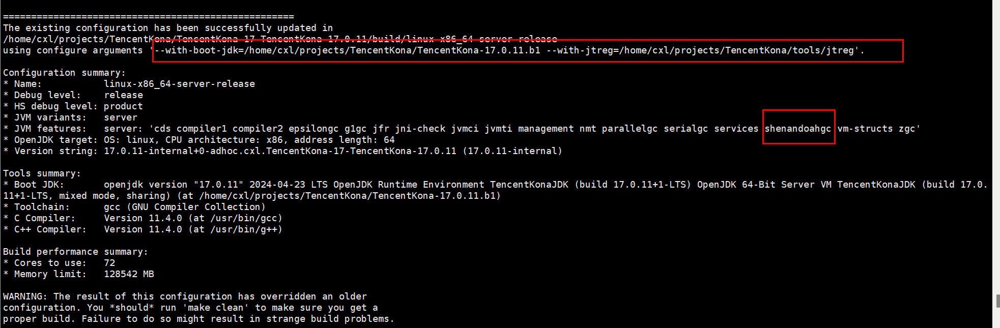

测试案例成功产生`JTreport`和`JTwork`文件

- 小错误：java自带环境变量为java8，删除且修改成java17后仍然找不到jdk17 的路径报错如下：

  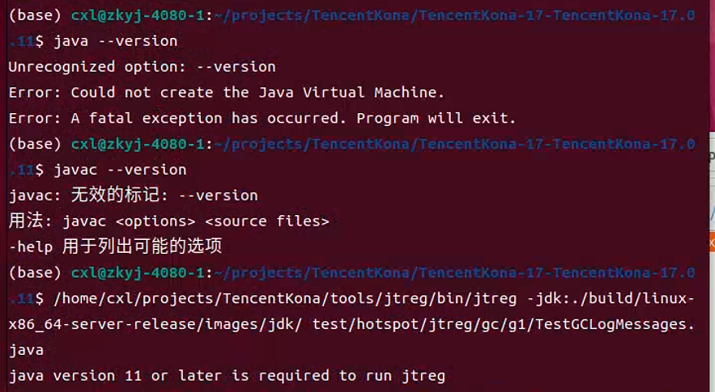

- 修改后，设置当前终端的环境变量，命令结果如下：

  - ```bash
    export JAVA_HOME=/home/cxl/projects/TencentKona/TencentKona-17-TencentKona-17.0.11/build/linux-x86_64-server-release/images/jdk 
    export PATH=$JAVA_HOME/bin:$PATH
    ```

    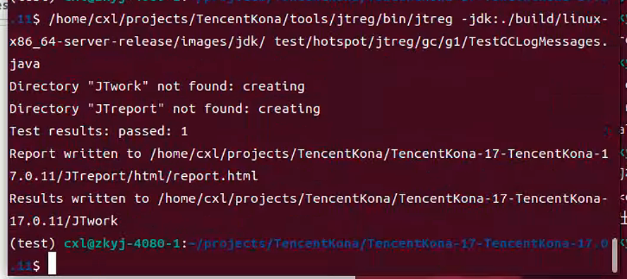

    


## 2.2 获取每一个old region 的 信息

因为调用每一个old region的信息，并且获得每一个old region中，存活对象占所有对象的百分比，因此新添加了1个api ： wb.printOldRegionInfo。在Java测试代码中实现结合wb.g1NumMaxRegions、wb.g1GetMixedGCInfo，拿到每1个old region的信息。

**添加的white box api代码**：

```c++
WB_ENTRY(jlongArray, WB_G1GetRegionInfo(JNIEnv* env, jobject o, jint regionIndex))
  if (!UseG1GC) {
    THROW_MSG_NULL(vmSymbols::java_lang_UnsupportedOperationException(), "WB_G1GetRegionInfo: G1 GC is not enabled");
  }
  G1CollectedHeap* g1h = G1CollectedHeap::heap();
  if (regionIndex >= 0 && regionIndex < (jint)g1h->max_regions()) {
    HeapRegion* r = g1h->region_at(regionIndex);
    if (r != nullptr && r->is_old()) {
      size_t live = r->live_bytes();
      size_t size = r->used();
      size_t percent = (size > 0) ? (int)(live * 100 / size) : 0;  // 确保除法安全
      uintptr_t rAddress = reinterpret_cast<uintptr_t>(r);
      typeArrayOop result = oopFactory::new_longArray(4, CHECK_NULL);
      result->long_at_put(0, live);
      result->long_at_put(1, size);
      result->long_at_put(2, percent);
      result->long_at_put(3, rAddress);
      return (jlongArray) JNIHandles::make_local(THREAD, result);
    }
  }
  return (jlongArray)JNIHandles::make_local(THREAD, NULL);
WB_END
```

**声明修改**

- whitebox.cpp

  ```c++
    {CC"g1GetRegionInfo",    CC"(I)[J",                   (void*)&WB_G1GetRegionInfo },
  ```

- WhiteBox.java

  ```java
   public native long[] g1GetRegionInfo(int regionIndex);
  ```

**Java测试代码中相关调用**

```java
private static void printOldRegionInfo(WhiteBox wb, int Percent) {
    DateTimeFormatter dtf = DateTimeFormatter.ofPattern("yyyy/MM/dd HH:mm:ss.SSS");
    LocalDateTime now = LocalDateTime.now();
    System.out.println("Current DateTime: " + dtf.format(now));


    long[] mixedGCInfo = wb.g1GetMixedGCInfo(Percent);  
    int maxRegions = (int)wb.g1NumMaxRegions();

    for (int i = 0; i < maxRegions; i++) {
        try {
            long[] regionInfo = wb.g1GetRegionInfo(i);
            if (regionInfo != null) {
                System.out.println("Region " + i + ":" + "Address: 0x" + Long.toHexString(regionInfo[3]));
                System.out.println("  Live bytes: " + regionInfo[0] + "  Total bytes: " + regionInfo[1] + "  Live percent: " + regionInfo[2] + "%");
            }
        } catch (IllegalArgumentException e) {
            System.err.println("Error fetching region info for region " + i + ": " + e.getMessage());
        } catch (Exception e) {
            System.err.println("Unexpected error when fetching region info: " + e.getMessage());
        }
    }

    System.out.println("match Old Regions Count: " + mixedGCInfo[0]);
    System.out.println("Total Memory in Old Regions: " + mixedGCInfo[1]);
    System.out.println("Estimated Memory to Free in Old Regions: " + mixedGCInfo[2]);

}

```


## 2.3 jvm参数

jvm参数这边，主要通过控制G1HeapRegionSize=4m和Xms/Xmx128M，以期望对region数量进行控制，整个堆中，预计有32个regions，每1个region大小为4m

```java
private static OutputAnalyzer testWithMixedGCLiveThresholdPercent(int percent) throws Exception {
    ArrayList<String> basicOpts = new ArrayList<>();
    String gcLogFile = String.format("/home/cxl/projects/TencentKona/TencentKona-17-TencentKona-17.0.11/G1GC_%d.log", percent);
    String gcLogFileRemset = String.format("/home/cxl/projects/TencentKona/TencentKona-17-TencentKona-17.0.11/G1GCRemset_%d.log", percent);
    Collections.addAll(basicOpts, new String[] {
        "-Xbootclasspath/a:.",
        "-XX:+UseG1GC",
        "-XX:+UnlockDiagnosticVMOptions",
        "-XX:+UnlockExperimentalVMOptions",
        //                                       "-XX:G1NewSizePercent=5",        // ---------
        //                                       "-XX:G1MaxNewSizePercent=10",    // ---------
        "-XX:MaxGCPauseMillis=50",
        "-XX:+WhiteBoxAPI",
        "-XX:G1HeapRegionSize=4m",
        "-XX:G1HeapWastePercent=0",
        "-XX:G1ReservePercent=0",
        "-Xlog:gc+remset+tracking=trace:" + gcLogFileRemset + ":time",
        "-Xlog:gc*:file=" + gcLogFile + ":time,level",
        "-Xms128M",
        "-Xmx128M"});

    basicOpts.add("-XX:G1MixedGCLiveThresholdPercent=" + percent);

    basicOpts.add(GCTest.class.getName());
    basicOpts.add(String.valueOf(percent));
    ProcessBuilder procBuilder =  ProcessTools.createJavaProcessBuilder(basicOpts);
    OutputAnalyzer analyzer = new OutputAnalyzer(procBuilder.start());
    return analyzer;
}

```


## 2.4 Java 测试具体实现

主要**触发3种Concurrent Start**，借此来观测old regions 的信息。

- LRU：主要以Hash+双向链表进行实现，主要用于分配对象
- 主程序是通过调用LRU分配对象后，通过whitebox api调用，来观察oldregions 的重要信息
- 主要**实现3种目标和实现思路**
  - Pause Young (Concurrent Start ---->>>>> mixed) (**G1 Preventive Collection**) ：可以通过调整 `-XX:InitiatingHeapOccupancyPercent`参数来控制何时开始并发周期，例如使用率超过一定阈值时触发。
  - Pause Young (Concurrent Start ---->>>>> mixed) (**G1 Evacuation Pause**) ：可以通过持续分配小对象来迫使Eden区域快速填满，然后进行回收。
  - Pause Young (Concurrent Start ---->>>>> mixed) (**G1 Humongous Allocation**) ：可以通过持续分配超过region一半大小的对象来迫使寻找连续的空闲区域来存放这个对象。

**实现代码：**

<details>
    <summary>点击展开/折叠代码</summary>

```java
// 直接在其他测试文件中修改了，后续实验次数多后，不再创建新的文件
public class TestMixedGCLiveThreshold {
    private static final String pattern = "Remembered Set Tracking update regions total ([0-9]+), selected ([0-9]+)$";

    public static void main(String[] args) throws Exception {
        System.setProperty("test.timeout.factor", "60"); // 设置超时时间的乘数为60
        int liveThresholdPercent = Integer.parseInt(args[0]);

        OutputAnalyzer output = testWithMixedGCLiveThresholdPercent(liveThresholdPercent);
        output.reportDiagnosticSummary();
    }


    private static OutputAnalyzer testWithMixedGCLiveThresholdPercent(int percent) throws Exception {
        ArrayList<String> basicOpts = new ArrayList<>();
        String gcLogFile = String.format("/home/cxl/projects/TencentKona/TencentKona-17-TencentKona-17.0.11/G1GC_%d.log", percent);
        String gcLogFileRemset = String.format("/home/cxl/projects/TencentKona/TencentKona-17-TencentKona-17.0.11/G1GCRemset_%d.log", percent);
        Collections.addAll(basicOpts, new String[] {
                                       "-Xbootclasspath/a:.",
                                       "-XX:+UseG1GC",
                                       "-XX:+UnlockDiagnosticVMOptions",
                                       "-XX:+UnlockExperimentalVMOptions",

                                       "-XX:MaxGCPauseMillis=50",
                                       "-XX:+WhiteBoxAPI",
                                       // Parallel full gc can distribute live objects into different regions.
                                       "-XX:G1HeapRegionSize=4m",
                                       "-XX:InitiatingHeapOccupancyPercent=35",
                                       "-XX:G1HeapWastePercent=0",
                                       "-XX:G1ReservePercent=0",
                                       "-Xlog:gc+remset+tracking=trace:" + gcLogFileRemset + ":time",
                                       "-Xlog:gc*:file=" + gcLogFile + ":time,level",
                                       "-Xms128M",
                                       "-Xmx128M"});

        basicOpts.add("-XX:G1MixedGCLiveThresholdPercent=" + percent);

        basicOpts.add(GCTest.class.getName());
        basicOpts.add(String.valueOf(percent));
        ProcessBuilder procBuilder =  ProcessTools.createJavaProcessBuilder(basicOpts);
        OutputAnalyzer analyzer = new OutputAnalyzer(procBuilder.start());
        return analyzer;
    }

    private static boolean regionsSelectedForRebuild(String output) throws Exception {

        Matcher m = Pattern.compile(pattern, Pattern.MULTILINE).matcher(output);
        if (!m.find()) {
            throw new Exception("Could not find correct output for Remembered Set Tracking in stdout," +
              " should match the pattern \"" + pattern + "\", but stdout is \n" + output);
        }
        return Integer.parseInt(m.group(2)) > 0;
    }

    public static class GCTest {
        public static void main(String args[]) throws Exception {
            WhiteBox wb = WhiteBox.getWhiteBox();
            int liveThresholdPercent = Integer.parseInt(args[0]);
            System.out.println("--------------------------------------------------------------------------");
            System.out.println("now liveThresholdPercent" + liveThresholdPercent);
            // 获取老年代区域的数量和信息
            long maxRegions = wb.g1NumMaxRegions();
            int regionSize = wb.g1RegionSize();
            System.out.println("Total regions: " + maxRegions + ", Region size: " + regionSize);

            System.out.println("--------------------------------------------------------------------------");
            System.out.println("Before AllocateMemory:");
            printOldRegionInfo(wb, liveThresholdPercent);
            for(int i=0; i<6; i++) {
                allocateMemory(wb, 2500, liveThresholdPercent);  // 分配100个对象
                System.out.println("----------------------- in small xunhuan iter:" + i + "------------------------------");
              }
                System.out.println(" ------------ after 2500iters old region The "+ i +" epoch---------" );
                printOldRegionInfo(wb, liveThresholdPercent);
                if(i % 2== 0) {
                    allocateMemoryBig(wb, 30, liveThresholdPercent);  // 分配100个对象

                    while (wb.g1InConcurrentMark()) {
                        System.out.println("----------- 大量分配大对象，导致内存占领一般，提前引发Pause Young (Concurrent Start) (G1 Humongous Allocation) -----------------");
                        Thread.sleep(3000);
                    }
                    System.out.println("--------------- After Mixed/After allocate Big Objects -----------------------");
                    printOldRegionInfo(wb, liveThresholdPercent);
                }
                Thread.sleep(10);
            }

            System.out.println("----------------------- 主动触发 Start Concurrent Mark Cycle------------------------------");
            wb.g1StartConcMarkCycle();
            System.out.println("check In Concurrent Mark Cycle: " + wb.g1InConcurrentMark());
            while (wb.g1InConcurrentMark()) {
                Thread.sleep(1000);
            }
            System.out.println("check In Concurrent Mark Cycle after sleep 1000: " + wb.g1InConcurrentMark());
            // 5. 并发标记周期结束后，打印老年代状态
            System.out.println("After Concurrent Mark Cycle:");
            printOldRegionInfo(wb, liveThresholdPercent);


            // 3. 再分配一些对象到老年代，观察对象提升情况
            allocateMemory(wb, 10, liveThresholdPercent);  // 分配50个对象
            System.out.println("------------------ After AllocateMemory10 and and Before Concurrent Mark Cycle:------------------------");
            printOldRegionInfo(wb, liveThresholdPercent);

            // 4. 启动并发标记周期，并确保它结束
            wb.g1StartConcMarkCycle();
            System.out.println("check In Concurrent Mark Cycle: " + wb.g1InConcurrentMark());
            while (wb.g1InConcurrentMark()) {
                Thread.sleep(1000);
            }
            System.out.println("check In Concurrent Mark Cycle after sleep 1000: " + wb.g1InConcurrentMark());
            // 5. 并发标记周期结束后，打印老年代状态
            System.out.println("------------ After 手动 Concurrent Mark Cycle:------------------");
            printOldRegionInfo(wb, liveThresholdPercent);

        }

        private static void allocateMemory(WhiteBox wb, int count, int liveThresholdPercent) {
            LRUCache cache = new LRUCache(500);
            //List<Object> allocations = new ArrayList<>();
            final int objectSize = WhiteBox.getWhiteBox().g1RegionSize() / 100;
            for (int i = 0; i < count; i++) {
                cache.put(i, new byte[objectSize]);
                //allocations.add(new byte[objectSize]);
                if(wb.g1InConcurrentMark()) {
                    System.out.println("----------- Before Pause Young (Concurrent Start)  -----------------");
                    printOldRegionInfo(wb, liveThresholdPercent);
                    while (wb.g1InConcurrentMark()) {
                        try {
                            Thread.sleep(50); 
                        } catch (InterruptedException e) {
                            System.out.println("Thread was interrupted.");
                        }
                    }
                    System.out.println("----------- After Pause Young (Concurrent Start) (G1 Preventive Collection) / (G1 Evacuation Pause)  -----------------");
                    printOldRegionInfo(wb, liveThresholdPercent);
                    try {
                        Thread.sleep(100); // 睡眠1s
                    } catch (InterruptedException e) {
                        System.out.println("Thread was interrupted.");
                    }
                    System.out.println("----------- After Mixed (Concurrent Start) (G1 Preventive Collection) / (G1 Evacuation Pause) -----------------");
                    printOldRegionInfo(wb, liveThresholdPercent);
                }
                try {
                    Thread.sleep(5); // 睡眠20毫秒
                } catch (InterruptedException e) {
                    System.out.println("Thread was interrupted.");
                }
            }
        }

        private static void allocateMemoryBig(WhiteBox wb, int count, int liveThresholdPercent) {
            LRUCache cache = new LRUCache(5);
            //List<Object> allocations = new ArrayList<>();
            final int objectSize = WhiteBox.getWhiteBox().g1RegionSize() * 2;
            for (int i = 0; i < count; i++) {
                cache.put(i, new byte[objectSize]);
                if(wb.g1InConcurrentMark()) {
                    System.out.println("----------- Before Pause Young (Concurrent Start) (G1 Humongous Allocation)  -----------------");
                    printOldRegionInfo(wb, liveThresholdPercent);
                    while (wb.g1InConcurrentMark()){
                        try {
                            Thread.sleep(50); // 睡眠1s
                        } catch (InterruptedException e) {
                            System.out.println("Thread was interrupted.");
                        }
                    }
                    System.out.println("----------- After Pause Young (Concurrent Start) (G1 Humongous Allocation)   -----------------");
                    printOldRegionInfo(wb, liveThresholdPercent);
                    try {
                        Thread.sleep(100); // 睡眠1s
                    } catch (InterruptedException e) {
                        System.out.println("Thread was interrupted.");
                    }
                    System.out.println("----------- After Mixed (G1 Humongous Allocation) -----------------");
                    printOldRegionInfo(wb, liveThresholdPercent);
                }
                try {
                    Thread.sleep(20); // 睡眠20毫秒
                } catch (InterruptedException e) {
                    System.out.println("Thread was interrupted.");
                }
            }
        }

        // 打印老年代区域的信息
        private static void printOldRegionInfo(WhiteBox wb, int Percent) {
            DateTimeFormatter dtf = DateTimeFormatter.ofPattern("yyyy/MM/dd HH:mm:ss.SSS");
            LocalDateTime now = LocalDateTime.now();
            System.out.println("Current DateTime: " + dtf.format(now));


            long[] mixedGCInfo = wb.g1GetMixedGCInfo(Percent);
            int maxRegions = (int)wb.g1NumMaxRegions();

            for (int i = 0; i < maxRegions; i++) {
                try {
                    long[] regionInfo = wb.g1GetRegionInfo(i);
                    if (regionInfo != null) {
                        System.out.println("Region " + i + ":" + "Address: 0x" + Long.toHexString(regionInfo[3]));
                        System.out.println("  Live bytes: " + regionInfo[0] + "  Total bytes: " + regionInfo[1] + "  Live percent: " + regionInfo[2] + "%");
                    }
                } catch (IllegalArgumentException e) {
                    System.err.println("Error fetching region info for region " + i + ": " + e.getMessage());
                } catch (Exception e) {
                    System.err.println("Unexpected error when fetching region info: " + e.getMessage());
                }
            }

            System.out.println("match Old Regions Count: " + mixedGCInfo[0]);
            System.out.println("Total Memory in Old Regions: " + mixedGCInfo[1]);
            System.out.println("Estimated Memory to Free in Old Regions: " + mixedGCInfo[2]);

        }

    }


    public static class DLinkedNode {
        int key;
        byte[] value;
        DLinkedNode prev;
        DLinkedNode next;
        public DLinkedNode() {}
        public DLinkedNode(int _key, byte[] _value) {key = _key; value = _value;}
        public DLinkedNode(byte[] _value) {value = _value;}
    }
    public static class LRUCache {


        private HashMap<Integer, DLinkedNode> cache = new HashMap<>();
        private int size;
        private int capacity;
        private DLinkedNode head, tail;

        public LRUCache(int capacity) {
            this.size = 0;
            this.capacity = capacity;
            head = new DLinkedNode();
            tail = new DLinkedNode();
            head.next = tail;
            tail.prev = head;
        }

        public byte[] get(int key) {
            DLinkedNode node = cache.get(key);
            if (node == null) {
                return new byte[0];
            }
            moveToHead(node);
            return node.value;
        }

        public void put(int key, byte[] value) {
            DLinkedNode node = cache.get(key);
            if (node == null) {
                DLinkedNode newNode = new DLinkedNode(key, value);
                cache.put(key, newNode);
                addToHead(newNode);
                ++size;
                if (size > capacity) {
                    DLinkedNode tail = removeTail();
                    cache.remove(tail.key);
                    --size;
                }
            } else {
                node.value = value;
                moveToHead(node);
            }
        }

        private void addToHead(DLinkedNode node) {
            node.prev = head;
            node.next = head.next;
            head.next.prev = node;
            head.next = node;
        }

        private void removeNode(DLinkedNode node) {
            node.prev.next = node.next;
            node.next.prev = node.prev;
        }

        private void moveToHead(DLinkedNode node) {
            removeNode(node);
            addToHead(node);
        }

        private DLinkedNode removeTail() {
            DLinkedNode res = tail.prev;
            removeNode(res);
            return res;
        }
    }
}
```

</details>


# 三、分析结论

​	G1垃圾收集过程被划分为多个阶段，以优化性能并减少应用的停顿时间。

​	这些阶段包括**年轻代回收、并发标记周期、准备混合收集、以及混合收集**等。（因为查看更多实验情况）程序使年轻代的Eden区和Survivor区随着对象的产生迅速填满，触发年轻代回收，以释放空间供新对象使用。

​	在**并发标记阶段**，系统通过标记活跃对象来准备后续的回收动作。这一阶段结束后，G1会评估哪些老年代区域应被回收，这主要基于对象的存活时间和区域的占用情况。从而来判断是否进行可控的`Preventive Collection`，并且在难以分配的情况，甚至会触发`Pause Full`来压缩堆空间.

​	当前程序，导致老年代区域中的对象大部分是活跃的，并发标记后活跃对象的比例会较高，而在Mixed GC之后可能因为对象晋升和新对象的创建而暂时看起来活跃对象比例再次升高。

​	G1垃圾收集器**通过自适应调整和动态决策**的方式，能够灵活地在运行时调整垃圾收集策略。**例如**，`Concurrent Start Prepare Mixed 和 Mixed` 三个阶段可能不会连续执行，这取决于当前堆的状态和G1 GC的策略（JVM参数等）决定。这种设计允许G1根据实时的堆使用情况和历史收集数据来优化回收行为，减少对应用性能的影响。

​	**实现的要点，应该是G1 的 Prepare Mixed 阶段**：为了在不直接回收对象的情况下，评估和准备即将到来的混合回收，这一策略性的延迟有助于在更合适的时机执行回收，从而更有效地利用系统资源，减少全堆回收的需求，并且在必要时候通过Mixed GC 清理老年代中的部分区域，实现堆的管理。


