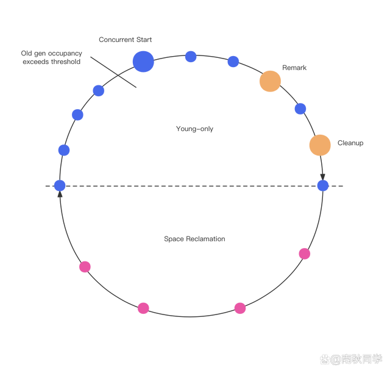
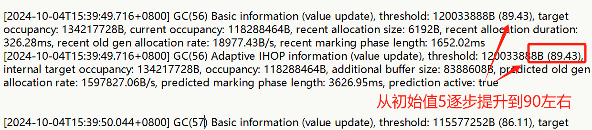
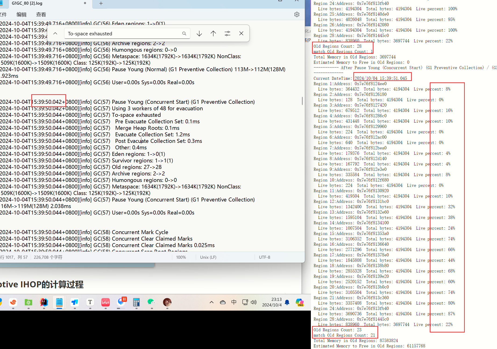
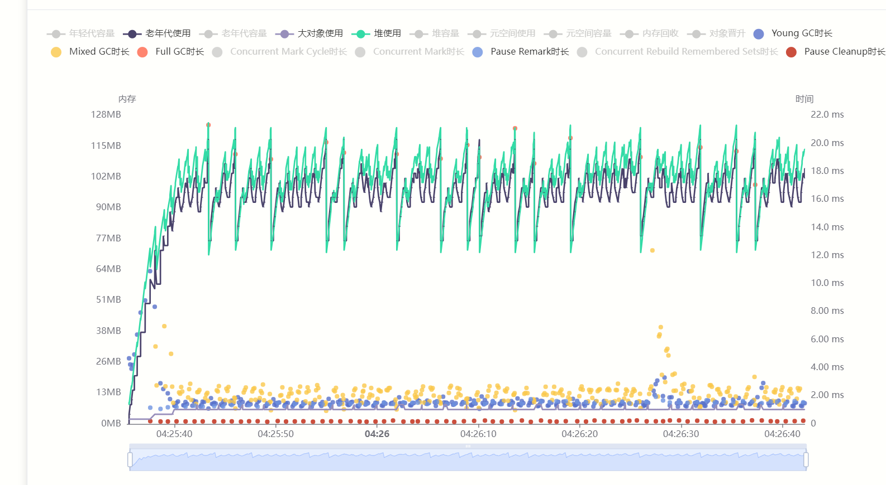
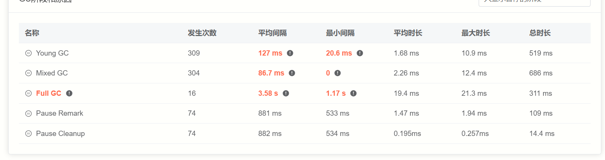
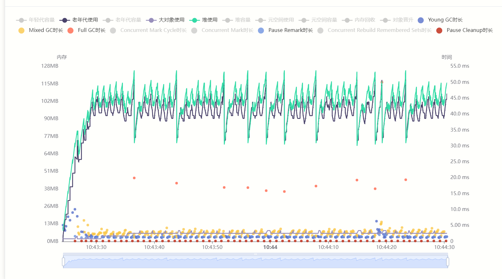
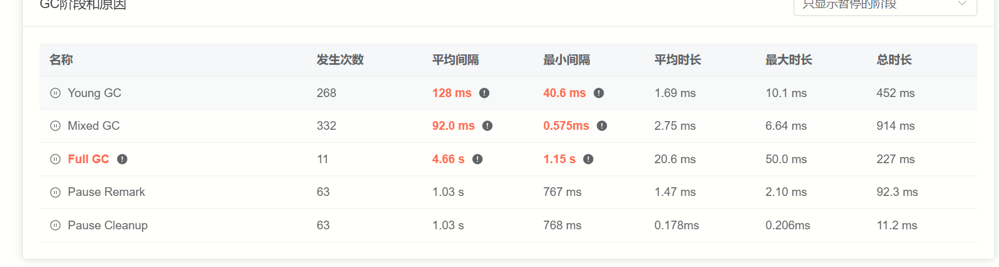

# 任务3

本次任务描述按照如下三个步骤进行展示：

1. G1 GC原理和重要参数解释；

 	2. G1 GC Mixed GC参数进行数学建模；
 	3. 实验结合修正；

因为设计`G1 GC`底层代码较多，在第1和第2阶段涉及到对应阶段时，会结合相关源码进行分析处理。

## 任务描述

任务二中的一些数据，分析目前情况下G1GC Adaptive IHOP的原理以及对于mixed GC的影响。
根据相关数据，尝**试优化一些mixed GC的参数的数值，使其能够根据Java进程的运行状态同样的进行动态调整**。


## 一、G1 原理和参数解释

### 1.1 G1 原理流程



G1 GC整体流程如上图，解释如下：

- 圆圈：表示G1回收过程中的暂停：
- 蓝色圆圈表示Young GC导致的暂停。
- 红色圆圈表示Mixed GC导致的暂停。
- 黄色圆圈表示有并发标记导致的暂停。
- 大蓝色圆圈：当老年代占用达到InitiatingHeapOccupancyPercent（老年代占整堆比，默认45%）设定的阈值时，下一个Young GC期间会开始进行并发标记。Young GC和并发标记可以穿插执行，在并发标记的过程中可能会出现多次Young GC，而Mixed GC只能在并发标记阶段完成后才能执行。

由上面图文可以得出下面几个结论：

1. Mark 和 Young GC一直是并行存在的（除开remark和clean up）
2. Clean up 是 global concurrent marking 阶段结束的标记，也是mixed GC开始的标记
3. 在全局标记结束后，mixed GC的次数不是固定值，可能发生多次


### 1.2 global concurrent marking 重要参数

****

#### **InitiatingHeapOccupancyPercent**（45 IHOP）

​	`IHOP` 定义了一个阈值，它表示当老年代堆的占用比例达到这个百分比时，G1GC 将开始准备触发global concurrent marking 阶段，**自动 IHOP 调整**，其目的是通过观测之前 GC 的行为，自动调整 IHOP 的值，以避免过多或过少的 GC 触发。

​	**较高的 IHOP 值**：意味着更晚启动Mark，风险在于老年代堆有更高的填满风险，可能会导致 Full GC 触发，从而带来较长的停顿时间。

​	**较低的 IHOP 值**：意味着更早启动Mark，这样可以更早地回收老年代的内存，减少 Full GC 发生的可能性，但可能增加频繁Mixed GC 带来的开销和短暂停顿。

```c++
size_t G1AdaptiveIHOPControl::get_conc_mark_start_threshold() {
  // 检查是否收集了足够的数据来进行有效的预测
  if (have_enough_data_for_prediction()) {
    // 预测下一次并发标记所需的时间
    double pred_marking_time = predict(&_marking_times_s);
    // 预测在这段时间内的对象晋升速率
    double pred_promotion_rate = predict(&_allocation_rate_s);

    // 根据标记时间和晋升速率计算预测的晋升大小
    size_t pred_promotion_size = (size_t)(pred_marking_time * pred_promotion_rate);

    // 计算标记期间预计需要的字节数
    size_t predicted_needed_bytes_during_marking =
      pred_promotion_size +
      // In reality we would need the maximum size of the young gen during
      // marking. This is a conservative estimate.
      // 事实上，我们需要在标记期间的年轻代的最大大小。这里使用一个保守的估计值。
      _last_unrestrained_young_size;
    // 计算内部的目标阈值(实际的目标阈值)
    size_t internal_threshold = actual_target_threshold();
    // 计算触发并发标记的开始阈值，
    // 这是基于预测的需要的字节减去内部阈值（如果大于内部阈值则设置为0，避免触发过早）
    size_t predicted_initiating_threshold = predicted_needed_bytes_during_marking < internal_threshold ?
                                            internal_threshold - predicted_needed_bytes_during_marking :
                                            0;
    return predicted_initiating_threshold;
  } else {
    // Use the initial value.
    // 如果没有足够的数据来进行预测，使用初始设置的IHOP百分比
    return (size_t)(_initial_ihop_percent * _target_occupancy / 100.0);
  }
}
```


### 1.3 Mixed GC 重要参数

这里每个参数的前后顺序，是按照代码中具体相关的顺序，介绍过程中也会给出代码中相关实现。

#### **G1MixedGCLiveThresholdPercent（85）**：

​	`G1MixedGCLiveThresholdPercent`它用于控制在Mixed垃圾收集（Mixed GC）过程中，哪些老年代（Old Generation）区域**应该被包含在回收范围内（candidate set）**。

​	通过调节-XX:G1MixedGCLiveThresholdPercent的值，避免活跃对象占比过高的Region进入CSet。因为活的对象越多，Region中可回收的空间就越少，暂停时间就越长，GC效果就越不明显。

```c++
bool G1CollectionSetChooser::should_add(HeapRegion* hr) {
  return !hr->is_young() &&
         !hr->is_pinned() &&
         region_occupancy_low_enough_for_evac(hr->live_bytes()) &&
         hr->rem_set()->is_complete();
}
static size_t mixed_gc_live_threshold_bytes() {
  return HeapRegion::GrainBytes * (size_t) G1MixedGCLiveThresholdPercent / 100;
}
```


#### **G1HeapWastePercent（5）**：

​	`G1HeapWastePercent`允许堆中浪费的空间百分比。该参数指定在Mixed GC触发时，允许老年代堆中存留多少未回收的垃圾。默认值是5%。

​	在全局并发标记结束后能够统计出所有可被回收的垃圾占Heap的比例值，如果超过5%，那么就会触发之后的多轮Mixed GC，mixed gc会同时回收年轻代+老年代，而这个参数可以指定mixed gc触发的时机。该**参数与InitiatingHeapOccupancyPercent 结合使用的话可以提前回收老年代（代码实现如下），让老年代提前释放空间。**

```c++
size_t G1AdaptiveIHOPControl::actual_target_threshold() const {
  // 计算保留空间和废弃空间的总百分比，并确保这个百分比不会超过100%。MIN2 函数确保即使两个百分比之和超过100%，也只取100%
  // 可用于垃圾收集的堆空间时，考虑到足够的缓冲区以应对意外情况，如晋升失败或无法回收的空间
  double safe_total_heap_percentage = MIN2((double)(_heap_reserve_percent + _heap_waste_percent), 100.0);

  return (size_t)MIN2(
    // heap()->max_capacity()这是一个方法调用，获取当前G1垃圾回收器管理的堆的最大容量
    // 确保了计算的实际目标阈值既不会超过[由于保留和浪费]导致的调整后的堆最大容量
    // 也不会超过按[目标占用率]调整后的值。
    G1CollectedHeap::heap()->max_capacity() * (100.0 - safe_total_heap_percentage) / 100.0,
    _target_occupancy * (100.0 - _heap_waste_percent) / 100.0
    );
}
```


#### G1OldCSetRegionThresholdPercent（10） and G1MixedGCCountTarget（8）

​	`G1OldCSetRegionThresholdPercent` 指定了在Mixed GC 中，老年代区域占整个堆空间的最大百分比，用来限制每次垃圾收集所能回收的老年代区域的数量（Candi。

​	**较高的值**：设置较高的百分比意味着 G1GC 在一次Mixed GC 中可以回收更多的老年代区域，有助于快速释放老年代的内存，防止 Full GC 的发生。但回收过多的老年代区域可能导致较长的 GC 停顿。

​	**较低的值**：设置较低的百分比限制老年代区域的回收数量，可以减少Mixed GC 的停顿时间，但可能导致老年代区域的回收不够充分，从而需要更多的Mixed GC 轮次（**注意：candidate set 进入 collection set的最小值会因此下降）**。

​	`G1MixedGCCountTarget` 指定了在标记阶段完成后，G1GC 计划执行的Mixed GC 轮次目标数量。**Mixed GC 逐步回收老年代的多个区域，而不是一次性全部回收**。这个参数设置了在一次标记周期之后，G1GC **期望**进行的Mixed GC 的次数。

​	**较高的值**：设置较高的轮次目标可以将老年代的回收任务分摊到更多的 GC 轮次中，这样每次 GC 的停顿时间会较短。但如果设置过高，回收进度太慢，可能**导致老年代堆积过多垃圾（为什么呢？后面数学建模会进行解答，简而言之：总是处理轻松的，麻烦的会堆积的越来越多）**，增加 Full GC 的风险。

​	**较低的值**：设置较低的目标值可以让Mixed GC 更快回收老年代的内存，从而降低老年代堆积的风险。但过少的Mixed GC 轮次可能导致每次 GC 需要回收更多的内存，从而增加停顿时间。

**为什么这两个参数要放在一起讨论？**

​	因为两个参数决定了Collection_Set的上限和下限！具体影响代码如下：

**calc_min_old_cset_length**和**calc_max_old_cset_length**：

```c++
uint G1Policy::calc_min_old_cset_length(G1CollectionSetCandidates* candidates) const {
  // The min old CSet region bound is based on the maximum desired
  // number of mixed GCs after a cycle. I.e., even if some old regions
  // look expensive, we should add them to the CSet anyway to make
  // sure we go through the available old regions in no more than the
  // maximum desired number of mixed GCs.
  //
  // The calculation is based on the number of marked regions we added
  // to the CSet candidates in the first place, not how many remain, so
  // that the result is the same during all mixed GCs that follow a cycle.

  const size_t region_num = candidates->num_regions();
  // candidates->num_regions / 8 < 204
  const size_t gc_num = (size_t) MAX2(G1MixedGCCountTarget, (uintx) 1);
  size_t result = region_num / gc_num;
  // emulate ceiling
  if (result * gc_num < region_num) {
    result += 1;
  }
  return (uint) result;
}

uint G1Policy::calc_max_old_cset_length() const {
  // The max old CSet region bound is based on the threshold expressed
  // as a percentage of the heap size. I.e., it should bound the
  // number of old regions added to the CSet irrespective of how many
  // of them are available.

  const G1CollectedHeap* g1h = G1CollectedHeap::heap();
  const size_t region_num = g1h->num_regions();   // 2048
  const size_t perc = (size_t) G1OldCSetRegionThresholdPercent; // 204
  size_t result = region_num * perc / 100;
  // emulate ceiling
  if (100 * result < region_num * perc) {
    result += 1;
  }
  return (uint) result;
}
```


## 二、参数关系和建模

### 2.1 参数关系

上一节，我们描述了G1 GC的整体流程和各个参数在Mark阶段和Mixed GC阶段中具体影响的信息。

​	Mixed GC主要由candidate set 和 collection set两个进行前后处理。

- **G1HeapWastePercent + IHOP** ：决定global concurrent marking阶段的开始时间
- **G1MixedGCLiveThresholdPercent**：它用于控制在Mixed垃圾收集（Mixed GC）过程中，哪些老年代（Old Generation）区域**应该被包含在回收范围内（candidate set）**
- **G1HeapWastePercent**：决定如何对回收范围内（candidate set）old region数量进行裁剪，去掉
- **G1OldCSetRegionThresholdPercent and G1MixedGCCountTarget**：决定collection set的左右边界，也决定Mixed GC次数


### 2.2 数学建模

在数学建模中，主要是基于任务2的Benchmark（针对任务三修改版）的实验结果观察。

#### **整体建模思路：**

​	**1.观察现象 	2.推测原因	3.找切入点	4.发现规律	5.数学建模	6.针对调整**

​	**1. 观察现象**：

​	在Benchmark实验过程中因为`IHOP`是自动调节的，根据代码中的算法，导致`IHOP`阈值越来越大，从而导致`老对象`越来越多的同时无法进行`Concurrent Mark`阶段，导致`To-space exhausted`情况，甚至`Pause Full`的情况。

​	IHOP自动调节到很高的位置



​	GC(56)满足IHOP条件后，进行GC(57)`Concurrent Mark`阶段，但可以看见，有大量的`死对象`甚至部分old region**存活率低于10%**！如果更早进行Mark标记，就不会导致`To-space exhausted`情况，并且提前处理这些垃圾对象



​	**2. 推测原因**：

​	`g1IHOPControl.cpp`文件中`get_conc_mark_start_threshold()`函数，来**决定IHOP的动态调节后的阈值**。在该函数中又调用到`actual_target_threshold()`函数，来对**堆实际阈值**进行获取。

​	在`actual_target_threshold()`函数中这个代码，观察到`_heap_waste_percent`数值。

函数对应代码：

`get_conc_mark_start_threshold()`函数：

```c++
    size_t internal_threshold = actual_target_threshold();
    size_t predicted_initiating_threshold = predicted_needed_bytes_during_marking < internal_threshold ?
                                            internal_threshold - predicted_needed_bytes_during_marking :
                                            0;
    return predicted_initiating_threshold;
```

`actual_target_threshold()`函数：

```c++
double safe_total_heap_percentage = MIN2((double)(_heap_reserve_percent + _heap_waste_percent), 100.0);
```

​	**3. 找切入点**	

​	因此**HWP+IHOP**决定了这个现象的发生，那么我希望mark阶段更早的来临，应该修改哪一个参数，G1HeapWastePercent （HWP）！HWP除了影响mark阶段的开始时间外，还会涉及到`candidate set`的裁剪。**因此以HWP为切入点合适吗？我们继续讨论**

​	**代码视角**：

​	虽然HWP会参与Mark阶段的开始时间（AdaptiveIHOP的变化），但是在Mixed GC阶段：

- G1 GC是所有old regions根据**G1MixedGCLiveThresholdPercent**先产生`candidate set`
- 对其排序，按照回收收益从高到低，产生`order_candidate set`
- 根据**HWP**进行逆序裁剪，产生`pruneed_candidate set`
- 根据**G1OldCSetRegionThresholdPercent** and **G1MixedGCCountTarget**，决定C_set的**大小**


​	可以发现，在Mixed GC阶段，**G1MixedGCLiveThresholdPercent**参数最早开始影响重要产出`candidate set`。

```c++
// 判断是否已经修剪的区域数超过了_max_pruned，或者当前浪费字节数加上当前区域的可回收字节数是否超过了_max_wasted。如果是，返回true，表示停止修剪。
  virtual bool do_heap_region(HeapRegion* r) {
    size_t const reclaimable = r->reclaimable_bytes();
    if (_num_pruned > _max_pruned ||
        _cur_wasted + reclaimable > _max_wasted) {
      return true;
    }
    r->rem_set()->clear(true /* cardset_only */);
    _cur_wasted += reclaimable;
    _num_pruned++;
    return false;
  }

void G1CollectionSetChooser::prune(G1CollectionSetCandidates* candidates) {
  G1Policy* p = G1CollectedHeap::heap()->policy();

  uint min_old_cset_length = p->calc_min_old_cset_length(candidates);

  // calc_min_old_cset_length函数来计算收集集中旧区域的最小数量。这个数量可能基于策略中设定的阈值，决定了至少需要回收多少旧代堆区。
  // 获取当前候选收集集（candidates）中的堆区总数。
  uint num_candidates = candidates->num_regions();

  if (min_old_cset_length < num_candidates) {
  // 通过HWP算出来
    size_t allowed_waste = p->allowed_waste_in_collection_set();

    G1PruneRegionClosure prune_cl(num_candidates - min_old_cset_length,
                                  allowed_waste);


    candidates->iterate_backwards(&prune_cl);

    log_debug(gc, ergo, cset)("Pruned %u regions out of %u, leaving " SIZE_FORMAT " bytes waste (allowed " SIZE_FORMAT ")",
                              prune_cl.num_pruned(),
                              candidates->num_regions(),
                              prune_cl.wasted(),
                              allowed_waste);

    candidates->remove_from_end(prune_cl.num_pruned(), prune_cl.wasted());
  }
}
```

​	反之，HWP虽然也会对mark阶段（IHOP）产生影响，但是在第一次mark阶段前，不好通过修正HWP（不直观）。更像是，HWP在mixed gc阶段，根据**G1MixedGCLiveThresholdPercent**修正后的数值，产生**联动影响**，从而影响下一次mark阶段（IHOP）的开始时间。

​	因此我认为，这四个参数在**Mixed GC阶段前（mark:clean up阶段后）**进行修正，其中认为**G1MixedGCLiveThresholdPercent**是Mixed GC阶段的切入点。


​	**4. 发现规律**

​	既然已经讨论到**G1MixedGCLiveThresholdPercent**作为切入点，那么我们就重点观察，他在G1 GC中的那个节点发生的变化。

​	从代码中可以发现，`G1Policy.cpp`文件中可以发现`record_concurrent_mark_cleanup_end`代码是标记clean up阶段结束，并且准备mixed gc阶段的**关键节点**

​	C_set.log和GC.log中也体现了，**G1MixedGCLiveThresholdPercent**决定了`candidate set`的大小。

​	**规律**：在IHOP动态 + 其他参数静态的Benchmark 试验下，可以观察出：

- old regions 数量（GC.log + Jtreg观测），`candidate set`，
- 通过HWP 修建后的 `Pruned_candidate set`，呈持续上升的状态，
- 当`nums(Pruned_candidate set)`达到 `_g1h->num_regions() / 2`（即达到堆regions数量的一半时）会产生`to-space`的现象，
- 超过`_g1h->num_regions() / 2`大小时候，会产生`Pause Full`的现象

​	也就是说，在**任务2中修改后高压的benchmark实验**中，当`nums(Pruned_candidate set)`接近 `_g1h->num_regions() / 2`，**整个G1 将会十分危险！**

​	同时还观察到，gc time小于jvm参数：Pause time，也就是说G1 GC通过动态调整这**四个**重要参数，应该会有一定空间的上升！


​	！！！ **5. 数学建模**    ！！！

​	既然已经找到观测到很危险的数据，同时因为

​	`candidate set(G1MixedGCLiveThresholdPercent) —>`

​	`Pruned_candidate set(HWP)—>`

​	`collection set(G1OldCSetRegionThresholdPercent and G1MixedGCCountTarget)`

的流程。

​	表现了`nums(Pruned_candidate set)`的**重要性！！！**下面简称PC_nums。

​	当第n次`PC_nums`接近`_g1h->num_regions() / 2`的时候，人为主观希望，`PC_nums`进行一定幅度的下降。

​	**如何使`PC_nums`下降呢？**

1. 调整`G1MixedGCLiveThresholdPercent`下降，使`candidate set`数量下降，并且其中每一个region的平均垃圾大小 > 调整前每一个region平均垃圾的大小，从而处理更多的垃圾和提升GC 时间，接近目标预期Pause time
2. 调整`G1HeapWastePercent `上升，上一步的操作，每一个region的垃圾%会上升，导致需要处理更多的垃圾，因此需要对应调节`G1HeapWastePercent `的容忍度，使`Pruned_candidate set`的大小保持不变会增加，从而处理更多垃圾和提升GC时间，接近目标预期Pause time
3. 但无论这两个参数如何进行对应的**正向变化**，基本都会导致`Pruned_candidate set`的不变或者增加，也会导致`collection set`的增加。为了适配这个情况，应该减少GC次数（左区间上升），提高OldSetPercent（右区间上升），`collection set`的**左右区间**应该同时上升，来缓解这个情况，增加每次GC的时间，接近目标Pause time。


​	**下降多少呢？该如何设计量**（这里只讨论高压，但是实验代码也有考虑低速的情况）

1. 因为PC_nums接近堆的一半大小（mark clean up阶段结束）时候，会导致出现 to-space 和 Pause Full（不对等） 的情况，需要在这次Mixed GC进行一个更好的规划。因此我设计一个10%（heap->nums * 10%）的**回调额度**，让PC_nums重新回到一个中等/中等偏上的一个程度（高压下），避免矫枉过正，导致超过Pause Time 的预期时间。算是一种比较中和的手段）
2. 因此我四个参数都是围绕这一个**回调额度**进行服务：(每次Mark后的计算)
- `G1MixedGCLiveThresholdPercent`下降的幅度约为（回调额度 * HeapSize * 1.5 = （100% - Chang_G1MixedGCLiveThresholdPercent (5%) ) * old regions ） 
- `G1HeapWastePercent `上升幅度约为（回调额度 * HeapSize * 1.5 = (1 + 2%)G1HeapWastePercent 
- Cset大小由GC次数和oldSetPercent 决定，在高压下，取max（增加的左边界数量， 增加的右边界数量），**在高压条件下和不超过Pause Time的情况下，让Cset增加是一个很好的选择** 


​	**6.针对调整**

​	因为本次程序设计，都是一种**规则设计**，主要目的使为了在尽量不超过Pause Time的条件下，减少 To-space 和Pause Full 的数量，以达到增加吞吐量的目的，因此下面是一些代码的边界条件处理。

1.	压力增加，如果放开C_set大小，cset容易爆炸增长（Max regions > heap_regions），因此需要进行上限固定。不超过`heap_regions/2`
2.	加一个，当其减小为负数时，直接将其置为0的判断
3.	待更新，（其实是没时间添加后续的代码修改）


## 三、实验

核心修改部分展示，全部在`任务3\任务3阅读文件夹\code`下面

### 代码实现

1. 添加`g1MixedGCParameterControl.cpp`、`g1MixedGCParameterControl.hpp`两个文件

```c++
void G1AdaptiveParameterControl::updateGCLivePercent (size_t candidate_after_pruned) {
  if (candidate_after_pruned >= _candidate_region_min_safe_after_pruned
   && candidate_after_pruned <= _candidate_region_max_safe_after_pruned)
    {
        //printf("GC-Live-safe! \n");
        return;
    }

  if (candidate_after_pruned < _candidate_region_min_safe_after_pruned) {
    // uintx grade = (_candidate_region_min_safe_after_pruned - candidate_after_pruned + 4) / (5);
    // _mixed_gc_live_threshold_percent += 5 * grade;
    // printf("GC-Live < \n");
  } else {
    // uintx grade = (candidate_after_pruned - _candidate_region_max_safe_after_pruned + 4) / (5);
    // _mixed_gc_live_threshold_percent -= 5 * grade;
    // printf("GC-Live > \n");
  }
}

// HWP
void G1AdaptiveParameterControl::updateHeapWastePercent (size_t candidate_after_pruned) {
  if (candidate_after_pruned >= _candidate_region_min_safe_after_pruned 
   && candidate_after_pruned <= _candidate_region_max_safe_after_pruned)
    {
        // printf("HWP safe\n");
        return;
    }


  if (candidate_after_pruned < _candidate_region_min_safe_after_pruned) {
    uintx grade = (_candidate_region_min_safe_after_pruned - candidate_after_pruned + 4) / (5);
    _heap_waste_percent += 3 * grade;
    // if(_heap_waste_percent >= 3 * grade) _heap_waste_percent -= 3 * grade;
    // else _heap_waste_percent = 0;
  } else {
    uintx grade = (candidate_after_pruned - _candidate_region_max_safe_after_pruned + 4) / (5);
    // _heap_waste_percent += 3 * grade;
    if(_heap_waste_percent >= 3 * grade) _heap_waste_percent -= 3 * grade;
    else _heap_waste_percent = 0;
  }

}

//    _gc_count_target(gcCountTarget),
//      _cset_percent(csetPercent){}

// 后两个参数
void G1AdaptiveParameterControl::updateGCCountAndCsetPercent (size_t candidate_after_pruned) {
  if (candidate_after_pruned >= _candidate_region_min_safe_after_pruned
   && candidate_after_pruned <= _candidate_region_max_safe_after_pruned)
    {
        // printf("GC-Live-safe! \n");
        return;
    }

  if (candidate_after_pruned < _candidate_region_min_safe_after_pruned) {
    uintx grade = (_candidate_region_min_safe_after_pruned - candidate_after_pruned + 4) / (5);

    // if (_gc_count_target >= 2 * grade)  _gc_count_target -= 2 * grade;
    // else _gc_count_target = 2;
    // _gc_count_target += 2 * grade;


    if (_cset_percent >= 3 * grade)  _cset_percent -= 3 * grade;
    else _cset_percent = 3;
    // _cset_percent += 6 * grade;


  } else {
    uintx grade = (candidate_after_pruned - _candidate_region_max_safe_after_pruned + 4) / (5);

    // if (_gc_count_target >= 2 * grade)  _gc_count_target -= 2 * grade;
    // else _gc_count_target = 2;
    // _gc_count_target += 2 * grade;


    // if (_cset_percent >= 3 * grade)  _cset_percent -= 3 * grade;
    // else _cset_percent = 3;
    _cset_percent +=  2 * grade;  if (_cset_percent > 25) _cset_percent = 20;

  }
```

2. 修改用到四大参数的相关每一个程序文件`g1CollectionSetChooser、g1FullCollector、g1IHOPControl、g1Policy`

   下面以G1Policy 为例

   **g1Policy.hpp**

   ```c++
   #include "gc/g1/g1MixedGCParameterControl.hpp"
   G1AdaptiveParameterControl adaptive_mixedgc;
   ```

   **g1Policy.cpp**：修改参数的时机和各个地方使用场景

   ```c++
   void G1Policy::record_concurrent_mark_cleanup_end(bool has_rebuilt_remembered_sets) {
     bool mixed_gc_pending = false;
     if (has_rebuilt_remembered_sets) {
       G1CollectionSetCandidates* candidates = G1CollectionSetChooser::build(_g1h->workers(), _g1h->num_regions());
       // ---------------------------- change ---------------------------
       size_t pruned_cand_num = candidates->num_regions();
       adaptive_mixedgc.updateGCLivePercent(pruned_cand_num);
       adaptive_mixedgc.updateHeapWastePercent(pruned_cand_num);
       adaptive_mixedgc.updateGCCountAndCsetPercent(pruned_cand_num);
       // ----------------------------------------------------------------
       _collection_set->set_candidates(candidates);
       mixed_gc_pending = next_gc_should_be_mixed("request mixed gcs", "request young-only gcs");
     }
   ```

   ```c++
   uint G1Policy::calc_min_old_cset_length(G1CollectionSetCandidates* candidates) const {
     const size_t region_num = candidates->num_regions();
     // ------------------------- changed ---------------------
     const uintx cur_gcc = adaptive_mixedgc.getGCCountTarget();
     const size_t gc_num = (size_t) MAX2(cur_gcc, (uintx) 1);
   //  const size_t gc_num = (size_t) MAX2(G1MixedGCCountTarget, (uintx) 1);
   // ------------------------------------------------------------------
     size_t result = region_num / gc_num;
     // emulate ceiling
     if (result * gc_num < region_num) {
       result += 1;
     }
     return (uint) result;
   }
   
   uint G1Policy::calc_max_old_cset_length() const {
   
     // ------------------------- changed ---------------------
     const uintx cur_csetpercent = adaptive_mixedgc.getCSetPercent();
     const G1CollectedHeap* g1h = G1CollectedHeap::heap();
     const size_t region_num = g1h->num_regions();
     const size_t perc = (size_t) cur_csetpercent;
   //  const size_t perc = (size_t) G1OldCSetRegionThresholdPercent;
   // ---------------------------------------------------------------------
     size_t result = region_num * perc / 100;
     // emulate ceiling
     if (100 * result < region_num * perc) {
       result += 1;
     }
     return (uint) result;
   }
   
   size_t G1Policy::allowed_waste_in_collection_set() const {
   // --------------------------- changed -----------------------------
     const uintx cur_HWP = adaptive_mixedgc.getHeapWastePercent();
     return cur_HWP * _g1h->capacity() / 100;
   //  return G1HeapWastePercent * _g1h->capacity() / 100;
   }
   ```

   


benchmar ：**TestMixedGCLiveThreshold.java** ：

```java
Collections.addAll(basicOpts, new String[] {
    "-Xbootclasspath/a:.",
    "-XX:+UseG1GC",
    "-XX:+UnlockDiagnosticVMOptions",
    "-XX:+UnlockExperimentalVMOptions",
    "-XX:+WhiteBoxAPI",
    "-XX:G1HeapRegionSize=2m",
    "-XX:MaxGCPauseMillis=50",
    "-Xlog:gc+ihop=trace:" + gcLogFileIHOP + ":time",
    "-Xlog:gc*:file=" + gcLogFile + ":time,level",
    "-Xlog:gc+ergo+cset=debug:"+ gcLogFileCset + ":time,level,tags",
    "-Xms128m",
    "-Xmx128m"});

```

```java
for (int i = 0; i < count; i++) {
    SecureRandom randPut = new SecureRandom();
    SecureRandom randGet = new SecureRandom();
    cache.put(i, new byte[objectSize_small]);
    cache.put(randPut.nextInt(100), new byte[objectSize_small * 2]);
    cache.get(randGet.nextInt(100));
    //allocations.add(new byte[objectSize]);
    if(i % 100 == 0){
        Hcache.put(randPut.nextInt(3), new byte[objectSize_small * 8]);
        Hcache.get(randPut.nextInt(3));
    }
    if(i % 10 == 0){
        System.out.println("----------- After allocat every objectSize/objectSize_small-----------------");
        printOldRegionInfo(wb, liveThresholdPercent);
    }
    if(wb.g1InConcurrentMark()) {
        System.out.println("----------- Before Pause Young (Concurrent Start)(G1 Preventive Collection) / (G1 Evacuation Pause)  -----------------");
        printOldRegionInfo(wb, liveThresholdPercent);
        while (wb.g1InConcurrentMark()) {
            //                        System.out.println("----------- 大量分配小对象，晋升old region，导致自我调配 现在正在执行四个阶段中-----------------");
            //                        System.out.println("----------- Pause Young (Concurrent Start) (G1 Preventive Collection) / (G1 Evacuation Pause)-----------------");
            try {
                Thread.sleep(50); // 睡眠1s
            } catch (InterruptedException e) {
                System.out.println("Thread was interrupted.");
            }
        }
        System.out.println("----------- After Pause Young (Concurrent Start) (G1 Preventive Collection) / (G1 Evacuation Pause)  -----------------");
        printOldRegionInfo(wb, liveThresholdPercent);
    }

    try {
        Thread.sleep(20); // 睡眠20毫秒
    } catch (InterruptedException e) {
        System.out.println("Thread was interrupted.");
    }
}
```


### 实验表格

从下面表格可以看出，因为上述方案的设计，导致 to -space 和 Full GC的数量实现一个较为客观的下降，但也因为有更多的old region 被选入 pruned_candidate set 导致 mixed GC次数增加。

同时因为更多的prune 因为HWP裁剪掉，未处理的 old region会更少，同时垃圾率会更高（垃圾占region的大小更大），容易在Full GC（Pause Full）的时候，对预期停止时间 Pause time 进行一个定格处理，这也是，为什么**吞吐量会下降一点**（因为 Full GC时间会占大头，有”竞争力“）

**总之，实验达到预期效果**

|          | BenchMark | AdaptiveMixGC |
| :------: | :-------: | :-----------: |
| to-space |    84     |      49       |
| Full GC  |    16     |      11       |
|  吞吐量  |  97.55%   |    97.44%     |
| Young GC |    309    |      268      |
| Mixed GC |    304    |      332      |

### 实验图标

**BenchMark**






**AdaptiveMixGC**






## 展望

1. 没有严格讨论`Humongous`大对象的情况，既然他是在global concurrent marking阶段的cleanup（大对象死去—> 整个/多个region没有活对象0liveprecent—>标记阶段直接被回收） 和 full GC阶段回收。那么在Mixed GC阶段，我们讨论old region所存在对象大小的时候，应该排除此时仍然存活的`Humongous`大对象。
1. 虽然还知道历史的晋升速度、历史的垃圾处理速度等因素，但是因为不够显然得出相关关系，因此没有进行进一步深入探究，没有想IHOP一样进行历史数据的动态调整，如果有时间，深入到更加底层的重要参数，应该会有更好的效果